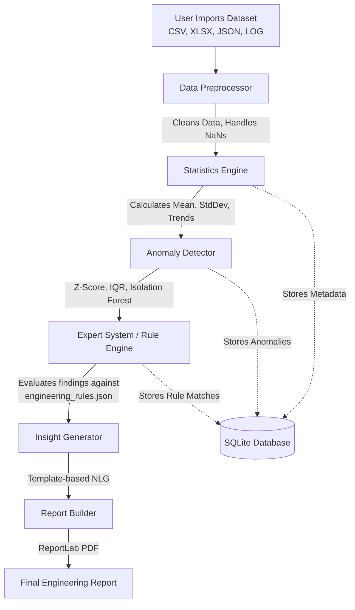

# AEIA (AI-Powered Engineering Insight Assistant) - Project Overview

## 1. Introduction
AEIA is an offline, single-user desktop application designed specifically for avionics and aerospace engineers. It imports raw telemetry and test-run datasets, performs statistical analysis, detects anomalies using Explainable AI (XAI), runs the findings through a domain-specific expert system, and generates a plain-language PDF report.

The system is designed to be **100% offline and CPU-bound**, requiring no internet access, no cloud APIs, and no GPUs, making it suitable for secure, air-gapped engineering environments.

---

## 2. Technology Stack
AEIA is built using a modern, robust Python ecosystem tailored for offline data science and desktop GUI deployment:

| Technology | Purpose in AEIA |
| :--- | :--- |
| **Python 3.10+** | Core programming language. |
| **PyQt5** | GUI framework used to build the desktop interface, handle background thread execution, and render interactive data tables. |
| **SQLite3** | Local database used to persist analysis history, findings, and metadata across sessions without requiring a database server. |
| **Pandas / NumPy** | Core data manipulation, memory management, and preprocessing of large telemetry datasets. |
| **SciPy** | Advanced statistical calculations (variance, distributions, trend analysis). |
| **Scikit-Learn** | Machine Learning library used specifically for **Isolation Forest** (unsupervised anomaly detection). |
| **ReportLab** | PDF generation engine used to compile the final executive summaries and charts into a printable format. |
| **Matplotlib** | Headless chart generation (scatter plots, distribution curves) embedded into the PDF reports. |
| **PyInstaller** | Packaging tool used to compile the entire Python environment and dependencies into a single standalone `.exe` file for Windows. |

---

## 3. Explainable AI (XAI) Implementation
A critical requirement of AEIA is that it must be **explainable and deterministic**. Aerospace engineering cannot rely on hallucination-prone Generative AI or black-box neural networks. 

Instead, AEIA implements AI using three transparent layers:

### A. Unsupervised Machine Learning (Anomaly Detection)
- **Isolation Forests (Scikit-Learn):** Used to detect multivariate anomalies in sensor data. It isolates observations by randomly selecting a feature and then randomly selecting a split value.
- **Statistical Outlier Detection:** Uses deterministic mathematical models (Z-Score > 3.0, IQR multipliers) to flag anomalies.

### B. Forward-Chaining Expert System (Rule Engine)
- The core "reasoning" engine is a deterministic rule evaluator. It loads domain knowledge from `rules/engineering_rules.json`.
- When an anomaly is detected (e.g., `vibration_hz > 500` AND `temp_c > 120`), the Expert System fires specific engineering rules to deduce the root cause (e.g., "Bearing Degradation").

### C. Template-Based Natural Language Generation (NLG)
- Instead of using a Generative LLM to write the report, AEIA uses a strict template-based NLG engine.
- This guarantees that the generated English text in the final PDF is mathematically grounded, directly traceable to the raw data, and completely immune to AI hallucinations.

---

## 4. Supported Data Types
AEIA is designed to ingest standard engineering telemetry formats. The preprocessor automatically cleans and standardizes the following file types:
- **.CSV** (Comma-Separated Values)
- **.XLSX** (Microsoft Excel Spreadsheets)
- **.JSON** (JavaScript Object Notation)
- **.TXT** (Delimited Text Files)
- **.LOG** (Standard System Log files)

---

## 5. System Architecture & Data Flow

The following flowchart illustrates the step-by-step pipeline from data ingestion to the final PDF report.

### Detailed Pipeline Breakdown
1. **Data Preprocessor:** Parses the file, standardizes timestamps, drops empty columns, and infers data types.
2. **Statistics Engine:** Runs a pass over the clean dataset to calculate baseline statistics (Mean, Median, Standard Deviation, Min/Max) for every column.
3. **Anomaly Detector:** Uses the baseline statistics and Scikit-Learn models to flag any data points that deviate from expected operational parameters.
4. **Expert System:** Cross-references the flagged anomalies against the engineering rules library to determine *why* the anomaly happened.
5. **Insight Generator:** Converts the raw mathematical findings into readable sentences (e.g., "Vibration spiked to 500Hz at row 42, indicating a critical threshold breach").
6. **Report Builder:** Compiles the insights, statistics, and Matplotlib charts into a highly polished, executive-ready PDF report.
