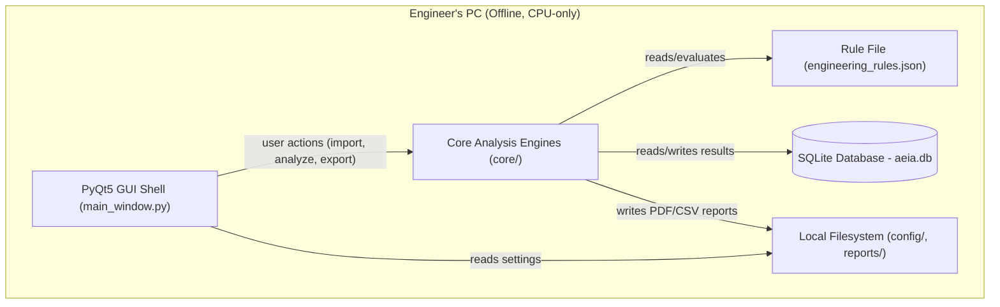
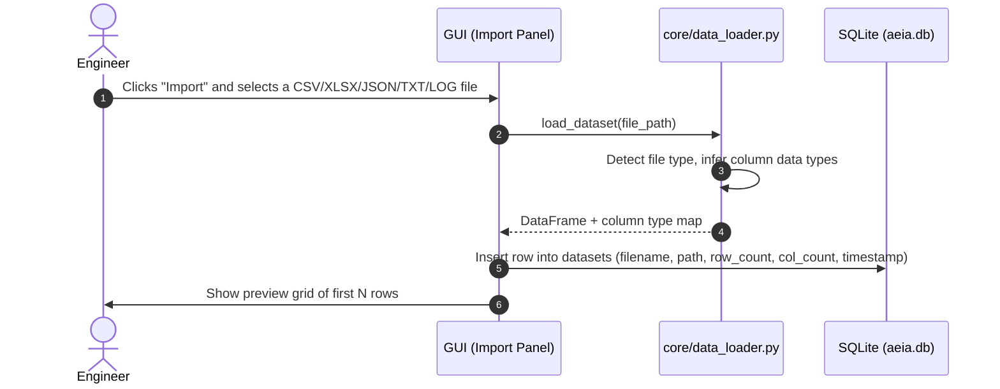
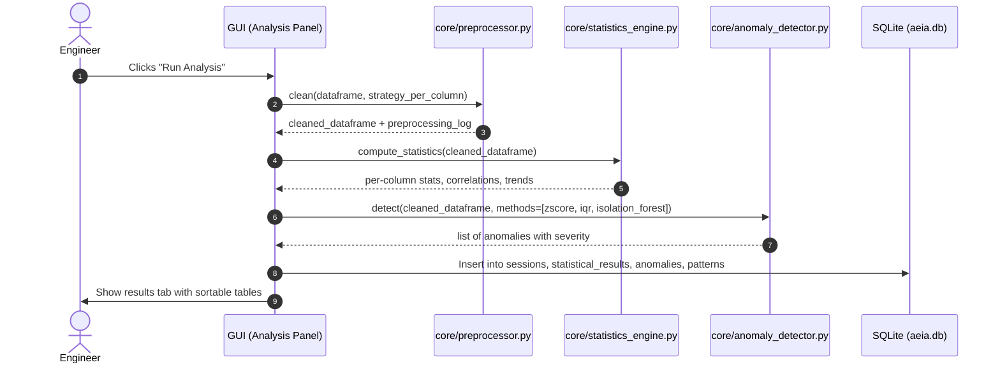
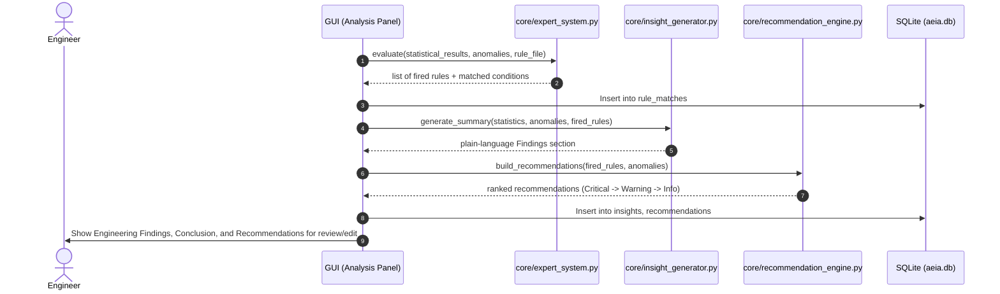
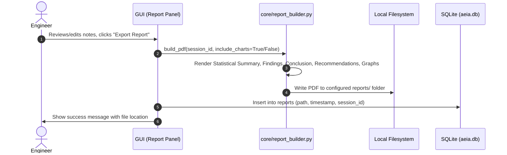

# High Level Design (HLD) - AI-Powered Engineering Insight Assistant (AEIA)

This document provides a high-level overview of the structure and flow of AEIA. It is designed to be
easily understood by a beginner.

---

## 1. System Architecture

AEIA is built as a **single-process desktop application** — there is no client-server split and no
network calls. Below is a diagram showing how the internal layers connect to each other:



### Layer Responsibilities

1. **GUI Shell (PyQt5)**
   - Runs entirely on the local machine; no browser, no server.
   - Presents the Import → Preprocess → Analyze → Review → Export workflow (FR-081).
   - Runs long operations on a background thread so the interface never freezes (FR-088).

2. **Core Analysis Engines**
   - Pure Python modules with no GUI dependencies, so they can be tested independently.
   - Includes the data loader, preprocessor, statistics engine, anomaly detector, rule engine,
     insight generator, recommendation engine, and report builder.

3. **Rule File (`engineering_rules.json`)**
   - A human-editable JSON file defining the expert system's condition → conclusion rules (FR-041).
   - Loaded and validated at startup and whenever Settings changes it.

4. **Database (SQLite)**
   - A single local file (`aeia.db`) storing session history, findings, and settings.
   - No server process required — SQLite is an embedded database that lives inside the app.

5. **Filesystem**
   - Stores configuration (`settings.json`), exported reports, and the SQLite file itself.
   - The original imported dataset file is read but never copied or modified (FR-020).

---

## 2. Local Data Layout

```
%APPDATA%/AEIA/
├── config/
│   └── settings.json            # thresholds, folders, UI preferences
├── rules/
│   └── engineering_rules.json   # editable expert-system rules
├── database/
│   └── aeia.db                  # session history & results
└── reports/
    └── {SessionID}_{Timestamp}.pdf
```

There is no year/folder numbering scheme like a document-register system — each analysis **Session**
is simply identified by an auto-incrementing ID and a timestamp (FR-098). The exact report filename
convention (and every other concrete formatting detail referenced loosely in this document) is pinned
down in `implementation_specification.md` §8.

---

## 3. Core Workflow Traces

### Trace 1: Import Dataset → Preview



---

### Trace 2: Preprocess → Analyze → Detect Anomalies



---

### Trace 3: Evaluate Rules → Generate Insights → Conclusion



---

### Trace 4: Export Report



---

## 4. Why No Client-Server Diagram?

Readers familiar with networked systems (like a browser-based app talking to a remote API) may expect
a client-server diagram here. AEIA intentionally has **no server tier** — it is a single offline
executable, so "the client" and "the server" are the same process running on the engineer's own
machine (NFR-001, NFR-002, EIR-002).
